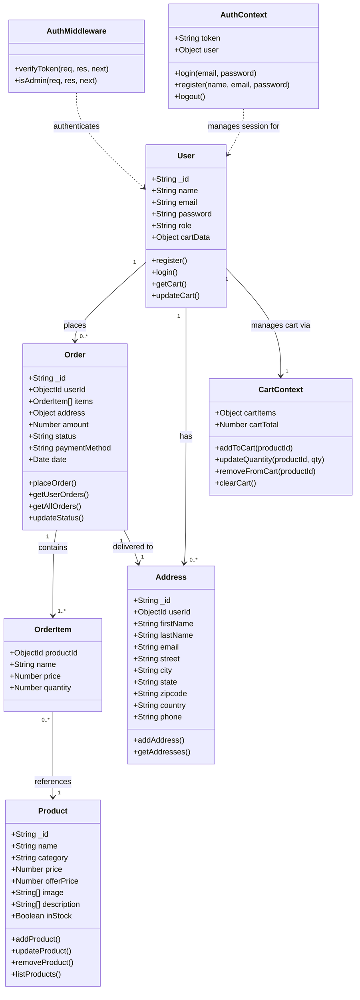

# Class Diagram — Grocery Delivery Web Application

## Overview
This diagram represents the data models, their attributes, methods, and relationships used across the backend (Mongoose schemas) and frontend (React contexts & services).

---

---

## Relationships Summary

| Relationship | Type | Description |
|---|---|---|
| User → Order | One-to-Many | A user can place multiple orders |
| User → Address | One-to-Many | A user can save multiple delivery addresses |
| Order → OrderItem | One-to-Many | Each order contains one or more items |
| OrderItem → Product | Many-to-One | Each order item references a product |
| Order → Address | One-to-One | Each order is linked to one delivery address |
| AuthMiddleware → User | Dependency | Middleware verifies JWT to identify the user |
| AuthContext → User | Dependency | Frontend context manages login state for a user |
| User → CartContext | Association | Each user's cart is managed via CartContext |
