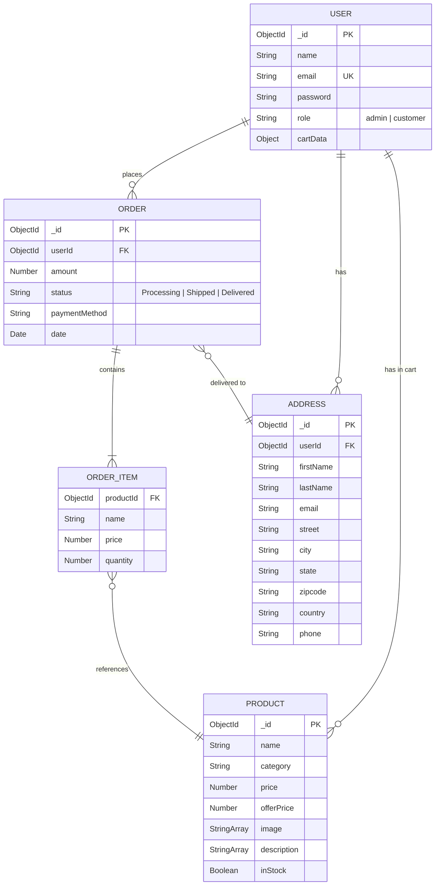

# ER Diagram — Grocery Delivery Web Application

## Overview
This Entity-Relationship diagram maps the MongoDB collections (User, Product, Order, Address) and their relationships as used in the application.

---

---

## Entity Descriptions

### USER
Stores registered users (both customers and admins). The `cartData` field holds a map of `productId → quantity` for the customer's current cart.

### PRODUCT
Represents grocery items available in the store. Supports multiple images and description lines. `offerPrice` is the discounted price shown alongside the original `price`.

### ORDER
Records a placed order. Links to the user who placed it and the delivery address. The `status` field tracks the order lifecycle: **Processing → Shipped → Delivered**.

### ORDER_ITEM
Embedded within an Order, each item records the product reference, its name and price at the time of purchase, and the quantity ordered.

### ADDRESS
Delivery addresses saved by users. A user can have multiple addresses and select one at checkout.

---

## Relationship Summary

| Relationship | Cardinality | Description |
|---|---|---|
| USER → ORDER | One-to-Many | A user can place multiple orders |
| USER → ADDRESS | One-to-Many | A user can save multiple delivery addresses |
| ORDER → ORDER_ITEM | One-to-Many | Each order contains one or more line items |
| ORDER_ITEM → PRODUCT | Many-to-One | Each line item references a product |
| ORDER → ADDRESS | Many-to-One | Each order is delivered to one address |
| USER → PRODUCT (cart) | Many-to-Many | Users can have multiple products in their cart |
