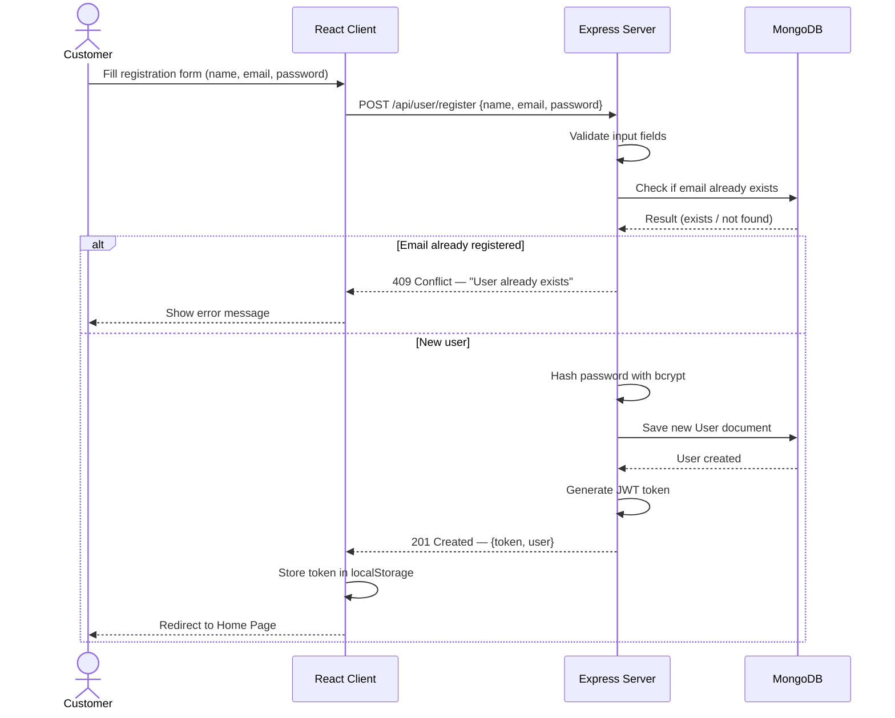
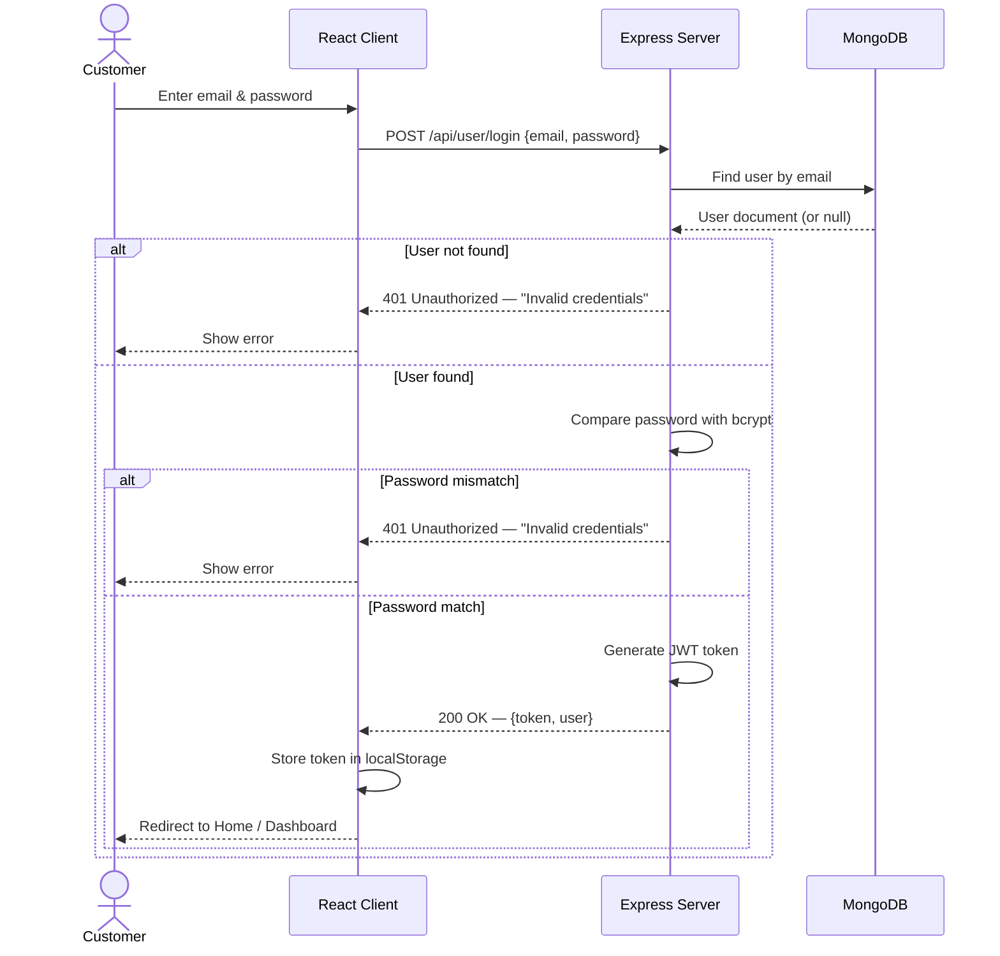
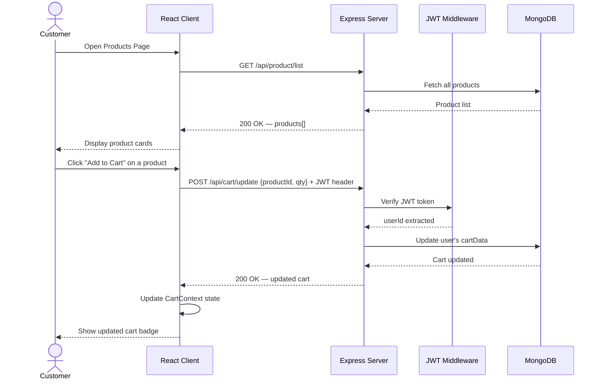
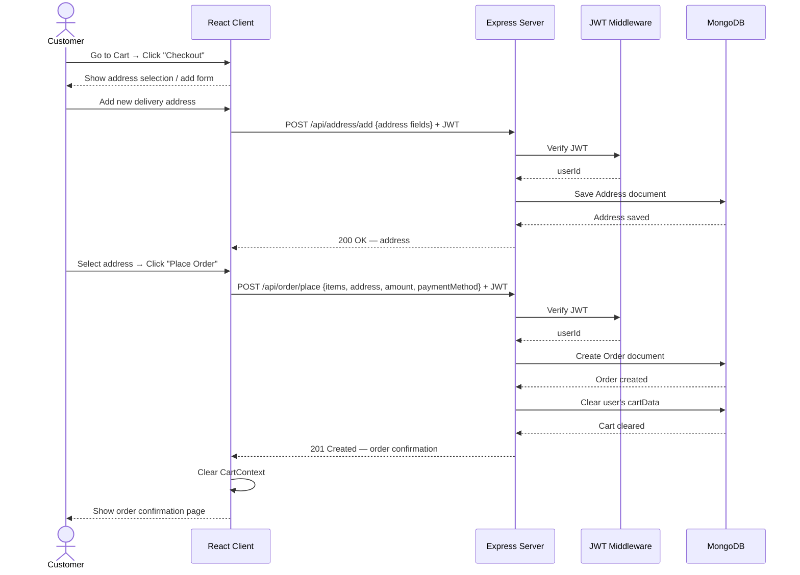
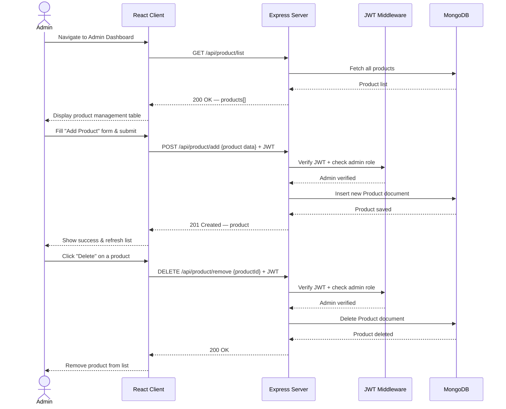
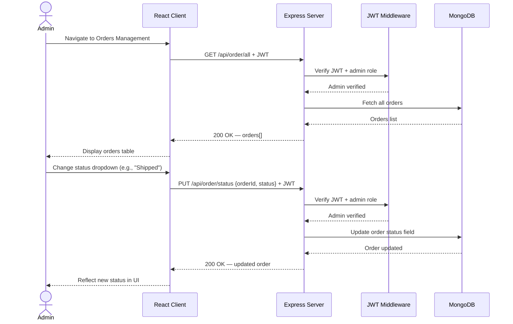

# Sequence Diagrams — Grocery Delivery Web Application

## Overview
These diagrams illustrate the step-by-step interactions between the **Client (React)**, **Server (Express API)**, **Middleware (JWT Auth)**, and **Database (MongoDB)** for the core application flows.

---

## 1. User Registration

---

## 2. User Login

---

## 3. Browse & Add to Cart

---

## 4. Checkout & Place Order

---

## 5. Admin — Manage Products

---

## 6. Admin — Update Order Status

