```mermaid
flowchart LR
    subgraph Actors
        Customer(("👤 Customer"))
        Admin(("🛠️ Admin"))
    end

    subgraph System["🛒 Grocery Delivery System"]
        direction TB

        subgraph Auth["Authentication"]
            UC1["Register"]
            UC2["Login"]
        end

        subgraph Shopping["Shopping"]
            UC3["Browse Products"]
            UC4["Search / Filter Products"]
            UC5["View Product Details"]
            UC6["Add to Cart"]
            UC7["Update Cart Quantity"]
            UC8["Remove from Cart"]
        end

        subgraph Ordering["Ordering"]
            UC9["Add Delivery Address"]
            UC10["Place Order"]
            UC11["View My Orders"]
            UC12["Track Order Status"]
        end

        subgraph AdminOps["Admin Operations"]
            UC13["Add Product"]
            UC14["Edit Product"]
            UC15["Delete Product"]
            UC16["Toggle Stock Status"]
            UC17["View All Orders"]
            UC18["Update Order Status"]
        end
    end

    %% Customer interactions
    Customer --- UC1
    Customer --- UC2
    Customer --- UC3
    Customer --- UC4
    Customer --- UC5
    Customer --- UC6
    Customer --- UC7
    Customer --- UC8
    Customer --- UC9
    Customer --- UC10
    Customer --- UC11
    Customer --- UC12

    %% Admin interactions
    Admin --- UC2
    Admin --- UC13
    Admin --- UC14
    Admin --- UC15
    Admin --- UC16
    Admin --- UC17
    Admin --- UC18
```

# Use Case Diagram — Grocery Delivery Web Application

## Overview
This diagram illustrates the interactions between the two primary actors (**Customer** and **Admin**) and the system's core functionalities.

---

---

## Use Case Descriptions

| # | Use Case | Actor | Description |
|---|----------|-------|-------------|
| UC1 | Register | Customer | Create a new account with name, email, and password |
| UC2 | Login | Customer, Admin | Authenticate via email & password, receive JWT token |
| UC3 | Browse Products | Customer | View products on home page and products page |
| UC4 | Search / Filter Products | Customer | Filter products by category or search keyword |
| UC5 | View Product Details | Customer | See image, description, price, and stock status |
| UC6 | Add to Cart | Customer | Add a product to the shopping cart |
| UC7 | Update Cart Quantity | Customer | Change quantity of an item in the cart |
| UC8 | Remove from Cart | Customer | Remove an item from the cart |
| UC9 | Add Delivery Address | Customer | Enter delivery address for checkout |
| UC10 | Place Order | Customer | Confirm cart items and address, create order |
| UC11 | View My Orders | Customer | See list of placed orders |
| UC12 | Track Order Status | Customer | Monitor status: Processing → Shipped → Delivered |
| UC13 | Add Product | Admin | Create a new product with details and images |
| UC14 | Edit Product | Admin | Update product name, price, description, etc. |
| UC15 | Delete Product | Admin | Remove a product from the catalog |
| UC16 | Toggle Stock Status | Admin | Mark a product as in-stock or out-of-stock |
| UC17 | View All Orders | Admin | See all customer orders |
| UC18 | Update Order Status | Admin | Change order status (Processing / Shipped / Delivered) |
